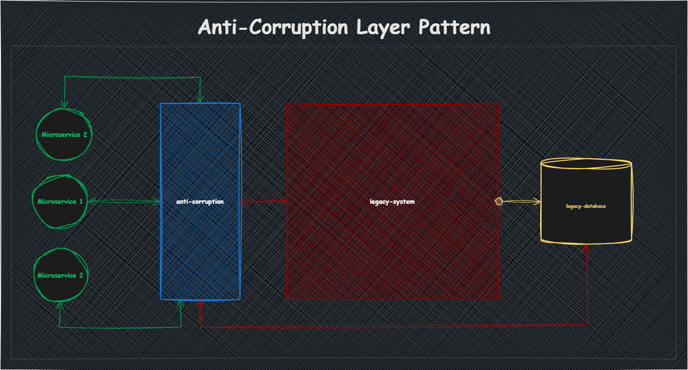
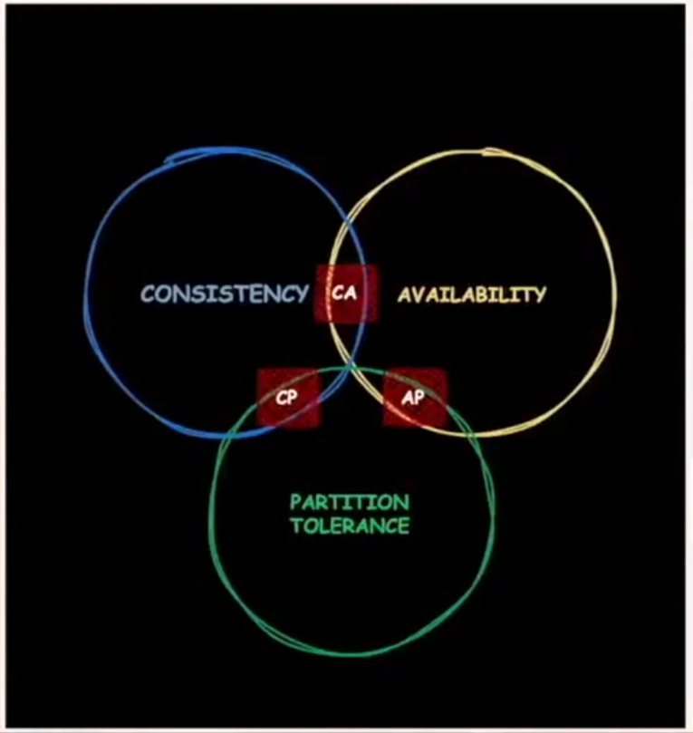

# Fundamentos Arquiteturais

## RAs - Requisitos Arquiteturais

Os Requisitos Arquiteturais (RAs) são as necessidades ou restrições que guiam o design e a implementação de uma arquitetura de software. Eles podem ser divididos em:

- **Requisitos Funcionais**: Definem o que o sistema deve fazer, como funcionalidades específicas.
- **Requisitos Não Funcionais**: Incluem aspectos como desempenho, escalabilidade, segurança e usabilidade.

## VAs - Variáveis Arquiteturais

As Variáveis Arquiteturais (VAs) representam as decisões ou escolhas que podem ser feitas durante o design da arquitetura. Elas são flexíveis e podem variar dependendo do contexto ou das necessidades do projeto. Exemplos incluem:

- Escolha de tecnologias (e.g., frameworks, linguagens de programação).
- Padrões arquiteturais (e.g., microsserviços, monolito).
- Estratégias de deploy (e.g., cloud, on-premises).

Esses conceitos ajudam a estruturar e organizar o processo de design arquitetural, garantindo que as decisões sejam bem fundamentadas e alinhadas aos objetivos do projeto.

## Stakeholders

Os stakeholders são todas as partes interessadas que possuem influência ou são impactadas pelo projeto de software. Eles podem incluir indivíduos, equipes ou organizações, e desempenham um papel fundamental na definição dos requisitos e no sucesso do projeto.

Exemplos de stakeholders no contexto da arquitetura de software:

- **Clientes/Usuários Finais**: Utilizam o sistema e fornecem feedback sobre suas necessidades e expectativas.
- **Equipe de Desenvolvimento**: Responsável por implementar a solução arquitetural.
- **Gerentes de Projeto**: Garantem que o projeto atenda aos prazos, orçamento e escopo.
- **Arquitetos de Software**: Definem e supervisionam a arquitetura do sistema.
- **Equipe de Operações**: Gerencia a infraestrutura e o deploy do sistema.
- **Investidores ou Patrocinadores**: Fornecem os recursos financeiros e esperam retorno sobre o investimento.

Entender as necessidades e expectativas dos stakeholders é essencial para criar uma arquitetura que atenda aos objetivos do projeto e agregue valor ao negócio.

## Custo | Prazo | Qualidade

Na arquitetura de software, é essencial considerar três pilares fundamentais: **Custo**, **Prazo** e **Qualidade**.

O arquiteto deve avaliar cuidadosamente esses aspectos ao iniciar o projeto, pois os requisitos arquiteturais serão definidos com base na prioridade estabelecida pela empresa. Por exemplo, a organização pode optar por priorizar a redução de custos, a entrega rápida ou a alta qualidade do produto final.

Essas decisões impactam diretamente as escolhas técnicas e estratégicas ao longo do desenvolvimento do projeto.

## Componentes Arquiteturais

Os componentes arquiteturais são elementos fundamentais de uma arquitetura de software, cada um com um propósito bem definido e responsável por executar tarefas específicas dentro do sistema. Eles colaboram para atender aos requisitos funcionais e não funcionais da aplicação, garantindo modularidade, escalabilidade e manutenibilidade.

### Exemplos de Componentes Arquiteturais:

- **Cache**: Armazena dados temporariamente para melhorar o desempenho e reduzir a latência de acesso.
- **Fila (Message Queue)**: Gerencia a comunicação assíncrona entre serviços, garantindo resiliência e desacoplamento.
- **API Gateway**: Atua como ponto de entrada único para APIs, gerenciando autenticação, roteamento e limitação de taxa (rate limiting).
- **Log**: Registra eventos e informações do sistema para auditoria, depuração e análise.
- **Monitoramento**: Coleta métricas e dados de desempenho para identificar problemas e garantir a saúde do sistema.
- **NoSQL**: Banco de dados não relacional, ideal para armazenar grandes volumes de dados não estruturados ou semi-estruturados.
- **RDBMS (Relational Database Management System)**: Banco de dados relacional, utilizado para armazenar dados estruturados com suporte a transações e consultas complexas.
- **Orquestrador de Containers**: Gerencia a implantação, escalabilidade e operação de contêineres (e.g., Kubernetes).
- **Identity Provider (IdP)**: Gerencia autenticação e autorização, permitindo Single Sign-On (SSO) e integração com provedores externos.

Esses componentes são escolhidos e configurados de acordo com as necessidades do projeto, garantindo que a arquitetura seja robusta, eficiente e alinhada aos objetivos do negócio.

## ACID

O acrônimo **ACID** representa os quatro pilares fundamentais que garantem a confiabilidade e integridade das transações em sistemas de banco de dados: **Atomicidade**, **Consistência**, **Isolamento** e **Durabilidade**.

- **Atomicidade**: Garante que todas as operações de uma transação sejam concluídas com sucesso ou, em caso de falha, nenhuma delas seja aplicada. É o princípio do "tudo ou nada".
- **Consistência**: Assegura que o banco de dados permaneça em um estado válido antes e depois da transação, respeitando todas as regras de integridade e restrições definidas.
- **Isolamento**: Garante que as transações sejam executadas de forma independente, sem interferir umas nas outras, mesmo quando ocorrem simultaneamente. Isso evita problemas como leituras sujas, leituras não repetíveis e leituras fantasmas.
- **Durabilidade**: Uma vez que uma transação é confirmada (commit), suas alterações são permanentemente gravadas no banco de dados, mesmo em caso de falhas no sistema.

Esses princípios são essenciais para garantir a integridade e a confiabilidade dos dados em sistemas transacionais.

## Camada de Integração

A camada de integração conecta diferentes sistemas ou serviços, permitindo a troca de informações de forma eficiente e confiável. Exemplos de abordagens comuns:

- **Arquivos**: Compartilhamento de arquivos via pastas compartilhadas ou FTP.
- **Filas**: Enfileiramento de mensagens para comunicação assíncrona (e.g., RabbitMQ, Kafka).
- **APIs**: Exposição de endpoints para comunicação síncrona ou assíncrona.
- **Banco de Dados**: Integração direta em nível de banco de dados, como consultas ou replicação.
- **Outros**: Webhooks para notificações em tempo real, gRPC para comunicação de alto desempenho e barramentos como ESB (Enterprise Service Bus).

Essas abordagens são escolhidas com base nos requisitos de desempenho, escalabilidade e desacoplamento do sistema.

## Consumer-Driven Contracts (CDC)

O padrão **Consumer-Driven Contracts** é uma abordagem para garantir que os contratos de comunicação entre microserviços sejam mantidos e testados de forma eficiente. Ele foca em validar que os serviços (producers) atendem às expectativas dos consumidores (consumers) em termos de APIs ou mensagens.

### Como funciona:

1. **Contrato Definido pelo Consumidor**:

   - O consumidor define um contrato que especifica como ele espera que o serviço produtor se comporte (e.g., formato de dados, endpoints, respostas esperadas).
   - Esse contrato é compartilhado com o produtor.

2. **Testes Baseados no Contrato**:

   - O consumidor testa localmente o contrato para garantir que ele está correto.
   - O produtor utiliza o contrato para validar que sua implementação atende às expectativas do consumidor.

3. **Automação**:
   - Ferramentas como **Pact** ou **Spring Cloud Contract** são usadas para automatizar a criação, validação e verificação dos contratos.

### Benefícios:

- **Desacoplamento**: Consumidores e produtores podem evoluir de forma independente, desde que respeitem os contratos.
- **Confiabilidade**: Reduz o risco de falhas na integração entre microserviços.
- **Feedback Rápido**: Problemas de compatibilidade são detectados cedo no ciclo de desenvolvimento.

### Exemplo:

Imagine um microserviço de pagamento (produtor) e um microserviço de pedidos (consumidor). O consumidor define um contrato que especifica:

- Endpoint: `POST /payments`
- Request body:
  ```json
  {
    "orderId": "123",
    "amount": 100.0
  }
  ```
- Response body:

```json
{
  "status": "success",
  "transactionId": "abc123"
}
```

Essa abordagem é amplamente utilizada em arquiteturas de microserviços para garantir a compatibilidade e a comunicação confiável entre serviços.

## Escalabilidade

A escalabilidade é a capacidade de uma aplicação ou sistema de lidar com um aumento na demanda de forma eficiente, mantendo o desempenho e a disponibilidade. Ela pode ser alcançada de duas formas principais:

1. **Escalabilidade Vertical**: Aumentar os recursos de um único servidor, como adicionar mais memória, CPU ou armazenamento.
2. **Escalabilidade Horizontal**: Adicionar mais instâncias ou servidores para distribuir a carga de trabalho.

Um sistema escalável é projetado para crescer de acordo com as necessidades do negócio, garantindo que ele continue a atender aos usuários mesmo em cenários de alta demanda.

## LOG

Os logs são registros fundamentais para monitorar, diagnosticar e melhorar a qualidade de sistemas de software. Eles desempenham um papel crucial em diversas áreas, como troubleshooting, análise de métricas e monitoramento contínuo.

### **Objetivos dos Logs**

1. **Troubleshooting**: Identificar e analisar erros ou falhas no sistema para facilitar a resolução de problemas.
2. **Métricas de Qualidade**: Avaliar a saúde do sistema, como tempo de resposta, taxa de erros e desempenho geral.
3. **Métricas de Infraestrutura**: Monitorar recursos como CPU, memória, rede e serviços utilizando ferramentas de APM (Application Performance Monitoring).
4. **Métricas de Negócio**: Obter insights sobre o comportamento do usuário, conversões e outros indicadores de desempenho relacionados ao negócio.
5. **Continuous Monitoring**: Garantir a observabilidade contínua do sistema, detectando anomalias em tempo real.

### **Tipos de Logs**

Os logs podem ser armazenados e gerenciados de diferentes formas, dependendo do contexto e da necessidade:

- **Banco de Dados**: Logs armazenados em tabelas para fácil consulta e análise estruturada.
- **Arquivo Texto**: Logs gravados em arquivos locais ou remotos, geralmente no formato `.log` ou `.txt`.
- **Bash**: Logs gerados por scripts de shell, úteis para automações e tarefas administrativas.
- **Ferramental Apropriado**: Uso de ferramentas especializadas como ELK Stack (Elasticsearch, Logstash, Kibana), Splunk, ou Datadog para coleta, análise e visualização de logs.

### **Estrutura de um Log**

Um log bem estruturado deve conter informações essenciais para facilitar a análise. Abaixo está um exemplo de estrutura JSON para logs:

```json
{
  "log_id": "unique-log-id",
  "type": "error", // 'error' | 'warning' | 'info'
  "title": "Descriptive title of the log",
  "message": "Detailed message explaining the log event",
  "stacktrace": "Stack trace for debugging (if applicable)",
  "timestamp": "2023-10-10T12:00:00Z",
  "context": {
    "user_id": "12345",
    "transaction_id": "abcde-67890",
    "service": "service-name"
  }
}
```

### **Boas Práticas para Logs**

1. **Padronização**: Use um formato consistente (como JSON) para facilitar a análise automatizada.
2. **Níveis de Log**: Classifique os logs em níveis como `DEBUG`, `INFO`, `WARNING`, `ERROR`, e `CRITICAL`.
3. **Contexto**: Inclua informações contextuais, como IDs de usuário, transações e serviços, para facilitar a rastreabilidade.
4. **Segurança**: Evite registrar informações sensíveis, como senhas ou dados pessoais, em texto claro.
5. **Rotação de Logs**: Implemente políticas de retenção e rotação para evitar o crescimento descontrolado dos arquivos de log.
6. **Monitoramento e Alertas**: Configure alertas para eventos críticos ou padrões anômalos detectados nos logs.

## Padrão SAGA

O padrão SAGA é uma abordagem para gerenciar transações distribuídas em sistemas de microsserviços. Ele divide uma transação longa em uma sequência de pequenas transações locais, cada uma executada por um serviço diferente. Caso alguma etapa falhe, o SAGA executa ações de compensação para desfazer as operações anteriores, garantindo a consistência dos dados sem a necessidade de bloqueios distribuídos.

## API Composition

O padrão arquitetural API Composition é utilizado para implementar consultas agregadas em sistemas de microsserviços. Nele, um componente (o API Composer) recebe uma requisição do cliente e orquestra chamadas a múltiplos microsserviços, combinando as respostas em um único payload. Esse padrão é indicado quando os dados necessários para uma operação estão distribuídos entre diferentes serviços, evitando acoplamento direto entre eles e simplificando a lógica de agregação no lado do cliente.

## Microservices Patterns

Os padrões de microserviços são abordagens arquiteturais e técnicas para projetar, implementar e operar sistemas baseados em microserviços. Eles ajudam a resolver desafios comuns e a padronizar práticas em ambientes distribuídos.

### Tipos de Microserviços

- **Microserviço Orquestrado**  
  Utiliza um componente central (orquestrador) para coordenar o fluxo de trabalho entre serviços, controlando a ordem e as dependências das operações (ex: SAGA Orquestrado).

- **Microserviço Coreografado**  
  Os próprios serviços reagem a eventos e interagem de forma descentralizada, sem um coordenador central, promovendo maior desacoplamento (ex: SAGA Coreografado).

- **Microserviço Online ou Batch**

  - _Online_: Processamento em tempo real, respondendo imediatamente a requisições.
  - _Batch_: Processamento em lotes, geralmente agendado ou disparado por eventos.

- **APIs, BFFs, Microservices**

  - _APIs_: Interfaces para comunicação entre serviços.
  - _BFF (Backend for Frontend)_: Camada intermediária que adapta APIs para diferentes clientes (web, mobile).
  - _Microservices_: Serviços independentes, cada um responsável por uma funcionalidade de negócio.

- **Síncronos ou Assíncronos**
  - _Síncronos_: Comunicação direta e imediata (ex: REST, gRPC).
  - _Assíncronos_: Comunicação desacoplada via mensagens ou eventos (ex: RabbitMQ, Kafka).

---

### Pontos Negativos dos Microserviços

- **Aumento da Complexidade**

  - Manutenabilidade: Mais difícil de manter devido à quantidade de serviços.
  - Segurança: Superfície de ataque maior, exige políticas robustas.
  - Observabilidade: Necessidade de monitoramento distribuído (logs, métricas, tracing).
  - Testabilidade: Testes de integração e ponta a ponta mais complexos.
  - Troubleshooting: Diagnóstico de falhas mais difícil devido à distribuição.
  - Deploy: Gerenciamento de múltiplos pipelines e versões.

- **Padronização e Padrões**

  - É fundamental definir padrões de implementação, comunicação, autenticação e deploy para garantir interoperabilidade e governança.

- **Custos**
  - Equipes maiores e mais especializadas.
  - Maior necessidade de automação e ferramentas de DevOps.
  - Mais recursos de infraestrutura (rede, storage, CI/CD, observabilidade).
  - Componentes arquiteturais adicionais (API Gateway, Service Mesh, etc).

---

### Pontos Positivos dos Microserviços

- **Escalabilidade e Elasticidade**

  - Permite escalar apenas os serviços necessários, otimizando custos e recursos.
  - Elasticidade: Capacidade de ajustar recursos conforme demanda (pay-as-you-go).

- **Disponibilidade e Resiliência**

  - Falhas em um serviço não afetam todo o sistema.
  - Possibilidade de deploys independentes e rollback mais seguro.

- **Time to Market**

  - Equipes podem trabalhar de forma autônoma, acelerando entregas e inovação.

- **Suporte a Times Multidisciplinares**

  - Permite que especialistas atuem em domínios específicos, promovendo ownership.

- **Suporte a Grande Volume de Usuários**
  - Arquitetura preparada para atender alta demanda e crescimento contínuo.

---

> **Resumo:**  
> Microserviços trazem benefícios claros de escalabilidade, resiliência e agilidade, mas exigem maturidade técnica, padronização e investimento em automação e observabilidade para lidar com a complexidade e os custos adicionais.

## Anti Corruption Layer Pattern

O padrão **Anti Corruption Layer (ACL)** é uma abordagem arquitetural utilizada para proteger o domínio de um sistema contra influências indesejadas de sistemas legados ou externos. Ele atua como uma camada intermediária que traduz, adapta e isola as diferenças de modelo, linguagem e regras de negócio entre dois contextos distintos, evitando que conceitos ou implementações inadequadas "contaminem" o novo sistema.



### Quando Utilizar

- **Integração com sistemas legados**: Quando é necessário consumir dados ou funcionalidades de um sistema antigo, cujas regras de negócio, modelos de dados ou terminologias são diferentes (ou inadequadas) para o novo sistema.
- **Migração gradual**: Ao migrar funcionalidades de um sistema legado para um novo, a ACL permite coexistência e comunicação sem acoplar diretamente os domínios.
- **Proteção do domínio**: Sempre que for importante manter a integridade e a clareza do modelo de domínio do sistema principal, evitando dependências diretas de sistemas externos.

### Exemplo Prático

Imagine que você está desenvolvendo um novo sistema de vendas, mas precisa consultar informações de clientes em um sistema legado, onde o conceito de "cliente" é diferente do seu novo domínio (por exemplo, o legado mistura pessoas físicas e jurídicas em um único campo, enquanto o novo sistema separa claramente esses conceitos).

**Sem ACL:**  
O novo sistema teria que lidar diretamente com as inconsistências e complexidades do legado, poluindo seu modelo de domínio.

**Com ACL:**  
Você cria uma camada anti corrupção que:

- Consome os dados do sistema legado.
- Traduz e adapta os dados para o modelo do novo sistema.
- Expõe apenas o que é necessário, no formato correto, para o domínio principal.


## Migração de Monolito para Microservices

### Strangler Pattern

O **Strangler Pattern** é uma estratégia para migrar sistemas monolíticos para microservices de forma gradual e segura. Em vez de reescrever todo o sistema de uma vez, novas funcionalidades são desenvolvidas como microservices independentes. Aos poucos, partes do monolito são substituídas por esses novos serviços, até que o monolito possa ser totalmente desativado.

**Vantagens:**

- Reduz riscos de migração.
- Permite testes e rollback mais fáceis.
- Facilita a adoção de novas tecnologias.

**Como funciona:**

1. Identifique uma funcionalidade do monolito para migrar.
2. Implemente essa funcionalidade como um microservice.
3. Use um roteador (proxy ou API Gateway) para direcionar as requisições para o monolito ou para o microservice.
4. Repita o processo até migrar todo o sistema.

## Decompose by Subdomain

A estratégia **Decompose by Subdomain** consiste em dividir um sistema monolítico em microservices com base nos subdomínios do negócio. Cada subdomínio representa uma área funcional ou contexto específico da aplicação, alinhando a arquitetura de software à estrutura do negócio.

**Vantagens:**

- Facilita a identificação de limites claros entre os serviços.
- Reduz o acoplamento entre equipes e funcionalidades.
- Permite que cada microservice evolua de forma independente.

**Como funciona:**

1. Identifique os subdomínios do negócio (por exemplo: faturamento, cadastro, logística).
2. Separe o código e os dados relacionados a cada subdomínio.
3. Implemente cada subdomínio como um microservice independente.
4. Defina contratos de comunicação claros entre os serviços.

Essa abordagem é fortemente baseada nos conceitos de Domain-Driven Design (DDD), promovendo uma arquitetura mais modular e alinhada aos objetivos do negócio.

## Teorema CAP



O Teorema CAP, proposto por Eric Brewer, afirma que em um sistema distribuído é impossível garantir simultaneamente os três requisitos a seguir:

- **Consistência (Consistency):** Todos os nós veem os mesmos dados ao mesmo tempo. Após uma operação de escrita, todas as leituras subsequentes retornam o valor atualizado.
- **Disponibilidade (Availability):** Todo pedido recebe uma resposta (sucesso ou falha), mesmo que parte do sistema esteja indisponível.
- **Tolerância à Partição (Partition Tolerance):** O sistema continua operando mesmo que haja falhas de comunicação entre partes do cluster (partições de rede).

Segundo o teorema, um sistema distribuído pode garantir, no máximo, dois desses três requisitos ao mesmo tempo. Por exemplo:

- **CA (Consistência + Disponibilidade):** Não tolera partições de rede.
- **CP (Consistência + Tolerância à Partição):** Pode não estar sempre disponível.
- **AP (Disponibilidade + Tolerância à Partição):** Pode retornar dados desatualizados (eventual consistency).

O CAP é fundamental para entender as decisões de arquitetura em sistemas distribuídos, como bancos NoSQL, e orientar escolhas de acordo com as necessidades do negócio.

## Micro-frontends

**Micro-frontends** é uma abordagem arquitetural onde uma aplicação frontend é dividida em partes menores e independentes, chamadas de micro-frontends. Cada micro-frontend é responsável por uma funcionalidade específica do sistema, podendo ser desenvolvido, testado e implantado de forma autônoma por diferentes times, assim como acontece com microservices no backend.

### Vantagens

- **Escalabilidade:** Permite que múltiplos times trabalhem de forma independente.
- **Reutilização:** Componentes podem ser reaproveitados em diferentes projetos.
- **Deploy independente:** Cada micro-frontend pode ser atualizado sem impactar o restante da aplicação.

### Exemplo de Aplicação

Imagine um e-commerce com as seguintes áreas:

- **Catálogo de Produtos**
- **Carrinho de Compras**
- **Perfil do Usuário**

Cada área pode ser um micro-frontend, desenvolvido com diferentes frameworks (React, Vue, Angular) e integrado em tempo de execução.

#### Exemplo prático usando Module Federation (Webpack 5)

**1. Catálogo de Produtos (Angular)**

```ts
// catalogo.component.ts
import { Component } from '@angular/core';

@Component({
  selector: 'app-catalogo',
  template: `<div>Catálogo de Produtos</div>`
})
export class CatalogoComponent {}
```

## Single Responsibility Principle

O Princípio da Responsabilidade Única (Single Responsibility Principle - SRP) é um dos princípios SOLID de design de software. Ele afirma que uma classe, módulo ou função deve ter apenas um motivo para mudar, ou seja, deve ser responsável por apenas uma parte específica da funcionalidade do sistema.

### Benefícios
- **Facilidade de manutenção:** Alterações em uma responsabilidade não afetam outras partes do código.
- **Reutilização:** Classes e funções com responsabilidades bem definidas são mais fáceis de reutilizar.
- **Testabilidade:** Unidades menores e focadas são mais simples de testar.

### Exemplo em Angular

```ts
// Responsável apenas por buscar dados de produtos
@Injectable({ providedIn: 'root' })
export class ProductService {
  constructor(private http: HttpClient) {}
  getProducts() {
    return this.http.get('/api/products');
  }
}

// Responsável apenas por exibir produtos
@Component({
  selector: 'app-product-list',
  template: `<ul><li *ngFor="let p of products">{{ p.name }}</li></ul>`
})
export class ProductListComponent implements OnInit {
  products: any[] = [];
  constructor(private productService: ProductService) {}
  ngOnInit() {
    this.productService.getProducts().subscribe(data => this.products = data);
  }
}